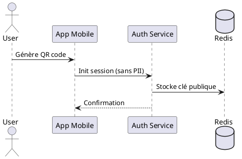

# Authentification et Sécurité

## Workflow de Connexion Anonyme



## Architecture de Sécurité

### Chiffrement End-to-End
- Protocole : Signal Protocol
- Chiffrement asymétrique : Courbe25519
- Chiffrement symétrique : AES-256-GCM
- Forward Secrecy : Double Ratchet Algorithm

### Stockage des Clés
| Composant | Méthode | Justification |
|-----------|---------|---------------|
| Clés privées | Secure Enclave | Protection matérielle |
| Sessions | Redis (encrypted) | Performance + TTL |
| Identités | PostgreSQL (HMAC) | Persistance sécurisée |

### Choix Techniques
| Choix | Alternative Rejetée | Raison |
|-------|-------------------|---------|
| Signal Protocol | MtProto (Telegram) | Standard ouvert, audité |
| Redis Sessions | Memcached | Persistence + Scalabilité |
| QR Code Auth | SMS/Email | Anonymat préservé |

## Mesures de Sécurité

### Protection contre les Attaques
- Rate limiting par IP
- Détection des tentatives de MITM
- Rotation des clés toutes les 24h
- Vérification des fingerprints

### Audit et Logging
```java
@Slf4j
public class SecurityAuditService {
    public void logAuthAttempt(UUID sessionId, AuthResult result) {
        log.info("Auth attempt: session={}, result={}", 
                 anonymize(sessionId), result);
    }
}