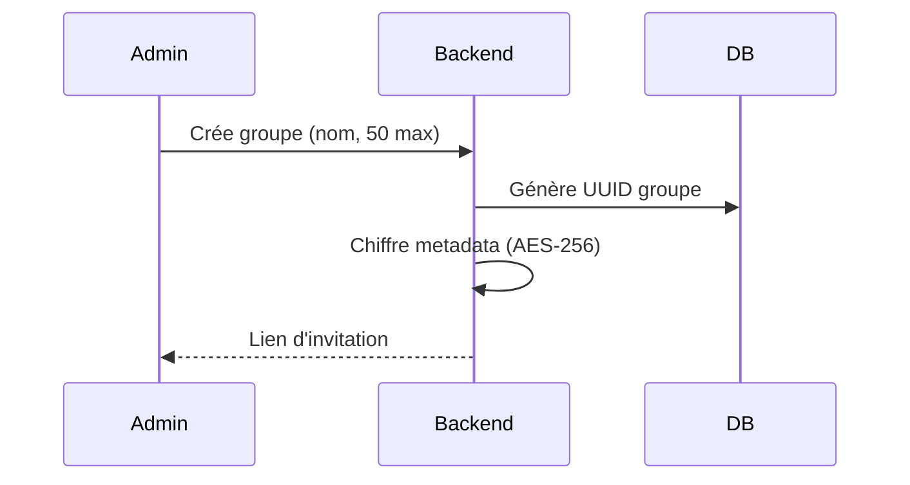

# Gestion des Groupes

## Workflow Création Groupe



## Architecture des Groupes

### Modèle de Données
```java
@Entity
public class Group {
    @Id
    private UUID id;
    
    @Column(encrypted = true)
    private String name;
    
    @ManyToOne
    private User admin;
    
    @ManyToMany
    private Set<User> members = new HashSet<>();
    
    @Column
    private int maxMembers = 50;
    
    @ElementCollection
    private Map<UUID, GroupRole> memberRoles;
}
```

### Hiérarchie des Rôles
| Rôle | Permissions |
|------|------------|
| CREATOR | Toutes les permissions + Suppression groupe |
| ADMIN | Gestion membres + Messages + Médias |
| MODERATOR | Gestion messages + Médias |
| MEMBER | Envoi messages + Médias |

## Sécurité des Groupes

### Chiffrement
- Clé de groupe unique (AES-256)
- Rotation automatique des clés
- Chiffrement des métadonnées

### Contrôle d'Accès
```java
@PreAuthorize("@groupSecurity.hasPermission(#groupId, 'MANAGE_MEMBERS')")
public void addMember(UUID groupId, UUID userId) {
    Group group = groupRepository.findById(groupId);
    if (group.getMembers().size() >= group.getMaxMembers()) {
        throw new GroupFullException();
    }
    // ... suite du code
}
```

## Invitations et Liens

### Format des Liens
```
https://app.domain.com/join/[GROUP_ID]/[ENCRYPTED_INVITE_TOKEN]
```

### Sécurité des Invitations
- Expiration automatique (24h par défaut)
- Usage unique
- Révocation possible par les admins