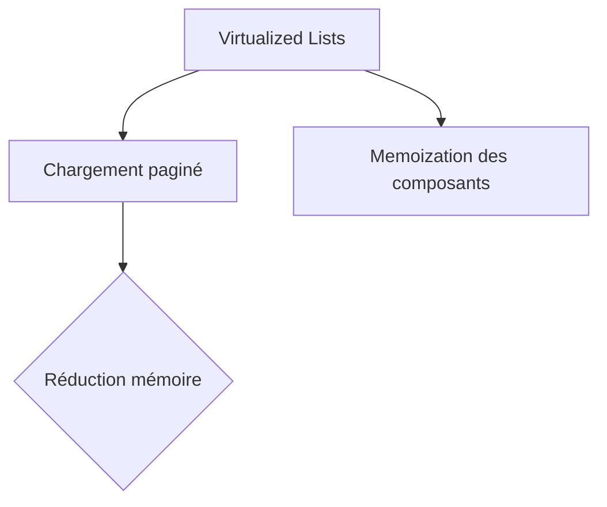

## Optimisation des Performances


## Gestion d'État
```javascript
// Exemple Redux Slice
const chatSlice = createSlice({
  name: 'chat',
  initialState: {
    encryptedMessages: [],
    currentGroup: null
  },
  reducers: {
    addEphemeralMessage: (state, action) => {
      state.messages.push({...action.payload, expiresAt: Date.now() + 3600})
    }
  }
})