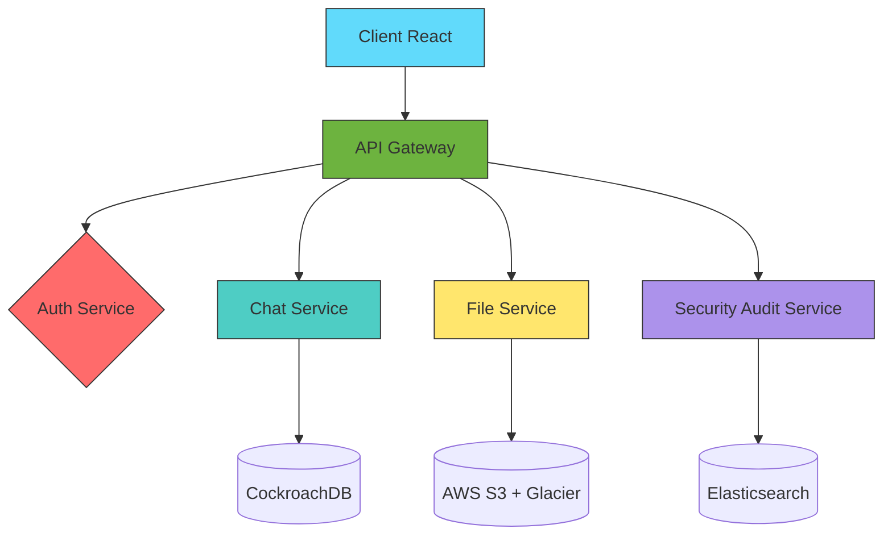

# Application de messagerie sécurisée inspirée de Telegram

Une solution de communication moderne avec chiffrement de bout en bout et contrôle total de votre vie privée.

## Fonctionnalités Clés

### 1. Authentification & Sécurité
- **Connexion anonyme**  
  ✅ Création de compte via pseudonyme/QR code  
  ✅ Validation OTP optionnelle (SMS/email)  
  🔒 Chiffrement E2E (Signal Protocol) avec Perfect Forward Secrecy
  
- **Protection avancée**  
  📵 Anti-Capture d'Écran natif (FLAG_SECURE Android/iOS)  
  🔄 Rotation automatique des clés de chiffrement  
  🛡️ Détection root/jailbreak avec réponse adaptative

### 2. Gestion du Profil
- **Personnalisation avancée**  
  🎨 Avatar/pseudonyme modifiable à volonté  
  📝 Bio personnalisable (140 caractères max) + badges de vérification
  
- **Contrôle des données**  
  👁️ Visibilité granulaire (statut en ligne, typing indicators)  
  🗑️ Suppression totale du compte avec purge GDPR en 72h

### 3. Gestion des Contacts
- **Recherche sécurisée**  
  🔍 Par pseudonyme exact ou QR code cryptographique  
  🔒 Restriction aux contacts existants + graphe de confiance
  
- **Organisation**  
  📒 Synchronisation E2EE du carnet d'adresses  
  ⛔ Blocage en cascade (utilisateur + groupe associé)

### 4. Messagerie Principale
#### Fonctions de base :
- ✉️ Messages texte avec statuts détaillés (✓✓✓ lu/délivré)
- 🖼️ Partage multimédia chiffré jusqu'à 2 Go (stream adaptatif)
- ⚡ Compression perceptuelle (WebP/AVIF/HEVC)

#### Fonctions avancées :
- ⏳ Messages éphémères (1s à 1 mois) avec preuve de destruction  
- 🕒 Programmation d'envoi/suppression + rappels  
- 😄 Réactions animées avec effets personnalisés  

### 5. Groupes & Canaux
- **Création**  
  👥 Groupes jusqu'à 5000 membres avec sharding dynamique  
  🧬 Clonage de groupes avec historique migrable  
  
- **Gestion**  
  👑 Hiérarchie de rôles (Créateur > Admin > Modo > User)  
  📌 Messages épinglés + sondages E2EE  
  ⚠️ Modération IA (détection flood/spam en temps réel)

### 6. Gestion des Médias
- 🔐 Stockage chiffré AES-256-GCM (S3 avec client-side encryption)  
- 🗓️ Expiration basée sur des règles personnalisables  
- 🖥️ Prévisualisation zero-knowledge + streaming adaptatif  

### 7. Sécurité Renforcée
- 🛡️ **Chats Secrets**  
  ✅ Chiffrement E2EE + Perfect Forward Secrecy  
  🔥 Auto-destruction obligatoire des messages  
  📸 Blocage natif des captures d'écran  

- **Watermarking**  
  🌊 Filigrane dynamique basé sur l'identité  
  🔍 Détection de capture via analyse heuristique  

### 8. Fonctionnalités Avancées
- 🤖 **Bots Intelligents**  
  🔌 Architecture plugin (Java ServiceLoader)  
  🧠 Intégration IA (GPT-4, Claude 2) avec sandboxing  
  
- **Mode Fédéré**  
  🌐 Interopérabilité Matrix Protocol  
  🔗 Gestion de clusters Kubernetes autonomes  

- **Analytics Privacy**  
  📊 Métriques chiffrées (Telemetry Encryption)  
  🧩 Fédération Learning pour détection d'abus  

## Stack Technique

```
# Front-end (React 18)
- State: Redux Toolkit + RTK Query
- UI: Material-UI v6 + Framer Motion
- Sécurité: WebCrypto API + OpenPGP.js

# Back-end (Java 17)
- Framework: Spring Boot 3 + Micronaut
- DB: CockroachDB + Redis Cluster
- Realtime: WebSocket + RSocket
- Sécurité: Bouncy Castle + Tink
```

## Architecture



## Installation

```bash
# Backend (nécessite Java 17+)
./gradlew clean build
docker-compose -f stack.yml up -d

# Frontend
npm install
npm run build
serve -s build -l 443
```

## Contribuer
**Exigences de sécurité** :
- Signature obligatoire des commits avec GPG
- Revue de code par 2 mainteneurs
- Tests d'intrusion obligatoires pour les nouvelles features

---

🔐 **Votre vie privée, notre priorité** - Code audité, architecture zero-trust, chiffrement par défaut

---
