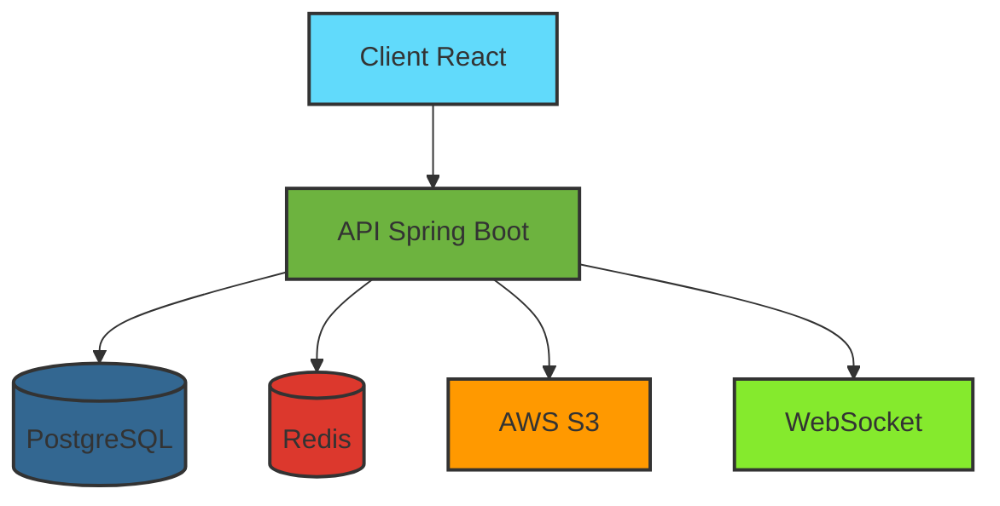

# Application de messagerie sécurisée inspirée de Telegram

Une solution de communication moderne avec chiffrement de bout en bout et contrôle total de votre vie privée.

## Fonctionnalités Clés

### 1. Authentification & Sécurité
- **Connexion anonyme**  
  ✅ Création de compte via pseudonyme/QR code  
  ✅ Validation OTP optionnelle (SMS/email)  
  🔒 Chiffrement E2E dès l'inscription (Signal Protocol/MtProto)
  
- **Gestion des sessions**  
  📱 Une seule session mobile active  
  🔄 Déconnexion automatique de l'appareil précédent

### 2. Gestion du Profil
- **Personnalisation avancée**  
  🎨 Avatar/pseudonyme modifiable à volonté  
  📝 Bio personnalisable (140 caractères max)
  
- **Contrôle des données**  
  👁️ Visibilité granulaire (statut en ligne, dernière connexion)  
  🗑️ Suppression totale du compte avec purge GDPR

### 3. Gestion des Contacts
- **Recherche sécurisée**  
  🔍 Par pseudonyme exact ou QR code  
  🔒 Restriction aux contacts existants
  
- **Organisation**  
  📒 Synchronisation optionnelle du carnet d'adresses  
  ⛔ Blocage complet d'utilisateurs

### 4. Messagerie Principale
#### Fonctions de base :
- ✉️ Messages texte avec statuts détaillés (✓✓✓ lu)
- 🖼️ Partage multimédia jusqu'à 2 Go (images/vidéos/PDF)
- ⚡ Compression adaptative selon connexion

#### Fonctions avancées :
- ⏳ Messages éphémères (1s à 1 semaine)
- 🕒 Programmation d'envoi/suppression
- 😄 Réactions avec emojis animés

### 5. Groupes & Canaux
- **Création**  
  👥 Groupes jusqu'à 50 membres  
  🧬 Clonage de groupes existants
  
- **Gestion**  
  👑 Rôles hiérarchiques (Créateur > Admin > User)  
  📌 Messages épinglés et sondages

### 6. Gestion des Médias
- 🔐 Stockage chiffré AES-256 (S3/Firebase)
- 🗓️ Expiration automatique configurable
- 🖥️ Prévisualisation & streaming adaptatif

### 7. Personnalisation Visuelle
- 🎨 Thèmes dynamiques (mode sombre/clair auto)
- 💬 Bulles de chat personnalisables
- 🌟 Fonds d'écran animés

### 8. Fonctionnalités Avancées
- 🔄 Synchronisation multi-appareils
- 💾 Backup chiffré avec clé de récupération
- 🤖 Détection de contenu abusif (ML fédéré)

## Stack Technique

```
# Front-end (React)
- Bibliothèques : Redux Toolkit, React Router
- UI : Material-UI, Styled Components

# Back-end (Java)
- Framework : Spring Boot
- Base de données : PostgreSQL + Redis
- Réaltime : WebSocket (STOMP)
- Stockage : AWS S3
```

## Architecture



## Installation

1. Cloner le dépôt
```
 (next time)
```

2. Configurer l'environnement
```
cd backend && mvn clean install
cd ../frontend && npm install
```

3. Démarrer les services
```
# Backend
mvn spring-boot:run

# Frontend
npm start
```

## Contribuer
Les contributions sont les bienvenues ! Veuillez suivre notre [guide de contribution](CONTRIBUTING.md).

---

🔐 **Protégez vos communications** - Conçu pour la confidentialité, développé pour la liberté
```

